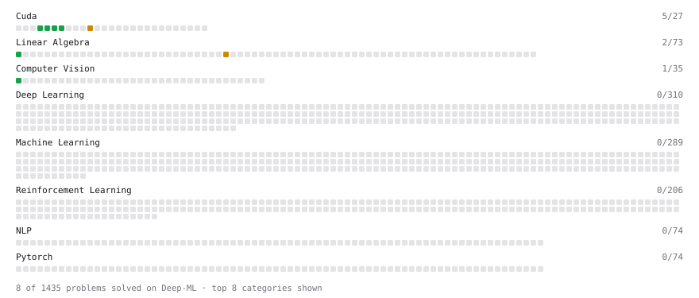

# Deep-ML

My machine learning practice from [Deep-ML](https://www.deep-ml.com). Every solution here was written by hand.

**11** solved · 11 problems · 0 labs · 0 math

[**Browse the interactive portfolio**](https://bzabk.github.io/deep-ml/) to replay this filling in over time.

## Problems

| | Difficulty | Solved | |
| --- | --- | --- | --- |
| [Calculate Image Brightness](https://www.deep-ml.com/problems/70) | easy | 2026-07-25 | [solution](problems/0070-calculate-image-brightness) |
| [Matrix-Vector Dot Product](https://www.deep-ml.com/problems/1) | easy | 2026-07-25 | [solution](problems/0001-matrix-vector-dot-product) |
| [ReLU Activation](https://www.deep-ml.com/problems/1204) | easy | 2026-08-29 | [solution](problems/1204-relu-activation) |
| [Scalar Multiply (a * x)](https://www.deep-ml.com/problems/1203) | easy | 2026-08-29 | [solution](problems/1203-scalar-multiply-a-x) |
| [Vector Addition](https://www.deep-ml.com/problems/1202) | easy | 2026-08-28 | [solution](problems/1202-vector-addition) |
| [Your First CUDA Kernel: Thread Index](https://www.deep-ml.com/problems/1201) | easy | 2026-08-28 | [solution](problems/1201-your-first-cuda-kernel-thread-index) |
| [Add Two Matrices (2D Grid)](https://www.deep-ml.com/problems/1206) | medium | 2026-09-22 | [solution](problems/1206-add-two-matrices-2d-grid) |
| [Compute Orthonormal Basis for 2D Vectors](https://www.deep-ml.com/problems/117) | medium | 2026-07-26 | [solution](problems/0117-compute-orthonormal-basis-for-2d-vectors) |
| [Dot Product](https://www.deep-ml.com/problems/1208) | medium | 2026-09-22 | [solution](problems/1208-dot-product) |
| [Naive Matrix Multiplication](https://www.deep-ml.com/problems/1209) | medium | 2026-09-22 | [solution](problems/1209-naive-matrix-multiplication) |
| [Parallel Reduction (Block Sum) CUDA Kernel](https://www.deep-ml.com/problems/1189) | medium | 2026-09-23 | [solution](problems/1189-parallel-reduction-block-sum-cuda-kernel) |

---

_This file is regenerated by Deep-ML on every push._
